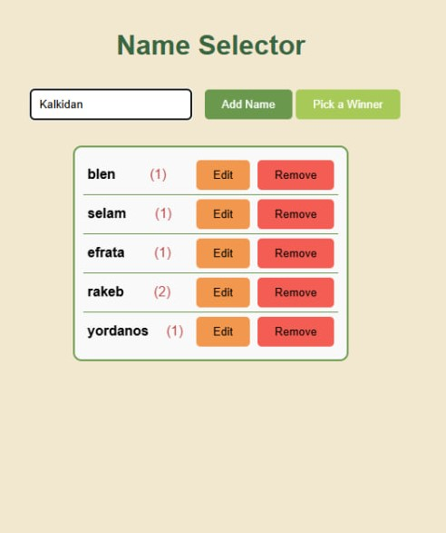

# Name Selector

A simple web application that allows users to enter names, track their occurrences, and randomly select a winner based on the names and their weights. The application features options to edit and remove names easily.

{width="300" height="200"} 


## Description

If parents are struggling to choose a name for their child, there's no need to worry! Name Selector will help you make the decision—just enter the names and let the magic happen!

## Features

- **Add Names**: Enter names in a text input, which are stored in lowercase.
- **Track Occurrences**: Each name's occurrence is tracked as a weight, displayed next to the name.
- **Edit and Remove**: Easily edit or remove names from the list.
- **Random Winner Selection**: Select a winner based on the names and their weights.
- **Responsive Design**: The application is styled for a clean and user-friendly interface.

## Technologies Used

- HTML5
- CSS3
- JavaScript

## Getting Started

To run the application locally, follow these steps:

1. **Clone the repository**:
   ```bash
   git clone https://github.com/Fine-Guy-21/NamePicker.git
